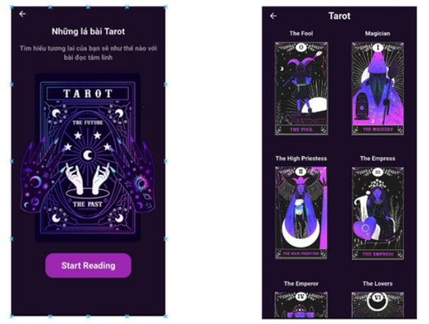

# stargazer

## Team Dev 
  - Thái Ngọc Quý  Admin | 0342280638

# Diagram describing the system's operation

      

# LLM RAG structure

   

## I.  Overall this applications
- UI: Flutter for mobile app.
- Back End: using Flask Framework to build Server Side API and apply model AI and LLM Chatbot  - language Python.
- Back End: Spring boot - language Java.
- Database: MySql , Milvus (vector database).

## II.  Demo Production

   

   

   

   

   

   

   